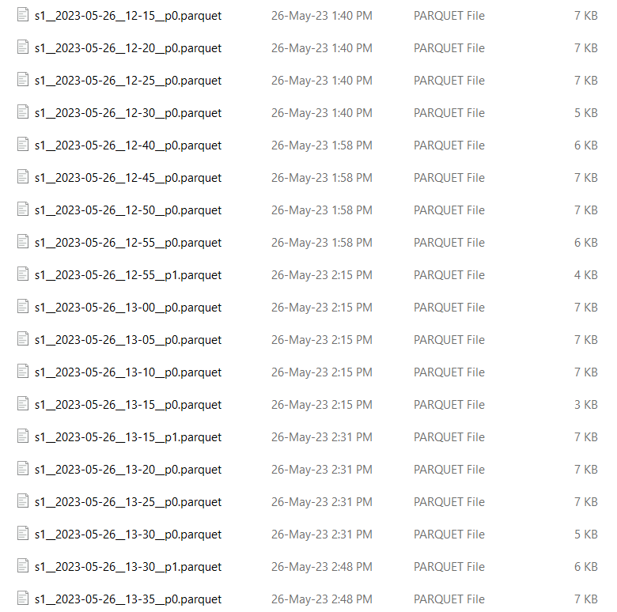

# Weather Stations Monitoring

The weather stations monitoring system shown in the figure was implemented in this project step by step.

## A. Write Weather Station Mock
> A weather station mock was implemented to output a status message
> every 1 second. The status message follows the provided schema:
> 
> The data in the status message is randomly changed. The timestamp is
> the timestamp at which the message is sent by the station. The battery
> status has 3 possible values: low, medium and high. They are randomly
> generated but following a specific distribution where from the
> messages sent by the weather station, 30% have the value "low", 40%
> have the value "medium", and 30% have the value "high". Also, random
> 10% of the messages are dropped.
> As will be shown later, 10 mock services of the weather station are
> run. All of them use the same class WeatherStation but an argument is
> passed on running which is the station id.

## B. Setup Weather Station to Connect to Kafka
> Java API is used to connect the weather station mock to the Kafka
> server. In the weather mock, after the message is generated as
> described before, it's published on a Kafka topic
> called"weather-messages".
>
> The following command is used to see the messages published on this
> topic: ./bin/windows/kafka-console-consumer.bat \--bootstrap-server
> 127.0.0.1:9092 \--topic weather-messages \--from-beginning\
> This is a sample of what is published on the topic:
> 
> 
> 
> #### [Source Code](Weather-Stations)
> There are two variants of the weather station on our repo. The first
> is WeatherStation which runs a single weather station. The second is
> WeatherStations which has two additional classes:
> - StationsRunner: for running 10 weather station mocks as separate processes and saving
> the processes ids to be terminated when desired.
> - StationsTerminator: for stopping the processes of weather station mocks.

## C. Implement Raining Triggers in Kafka Processors
> Rain Detector was implemented. It acts as both producer and consumer
> on Kafka. It subscribes to the "weather-messages" topic and checks the
> value of humidity in the consumed messages. If it's greater than 70%,
> Rain Detector produces (publishes) the message on another topic\
> "rain-detection" to indicate that it will probably rain.
>
> This is a sample of what's published on "rain-detection" topic:
> 
> 
> #### [Source Code](Rain-Detector)
> 

## D. Implement Central Station
> Central Station is organized as follows:
> - BitCask: this class handles writing to BitCask LSM directory and all related functions. 
> - Archive: this class handles writing to Parquet files and all related functions.
> - Central Station class: this class creates instances of BitCask and
> Archive and subscribes to the "weather-messages" Kafka topic. On
> consuming each message, it calls the append function of the both
> classes BitCask and Archive to handle adding the consumed message to
> both BitCask LSM directory and Parquet files.
>
> There are 2 directories for storing the created logs:
> - bitcask
> - parquet-files
>
> ### BitCask Riak to store updated view of weather status
> A key-value store of the stations' statuses was implemented. The
> implementation is of BitCask Riak LSM as described in the paper.
> However, a hint file is generated and kept for each generated log file
> to speed up merging.
> In order not to disrupt active readers, all the files are merged first
> creating the merged log and hint files by only reading from the old
> log and hint files then the old files are deleted.
>
> There is a [video](Central-Station/bitcask-directory-sample-video) showing the described behavior in the repo.
> For speeding up the testing time we set the maximum size of the log
> file to be 100KB and the maximum number of logs to keep before merging
> to be 5.
>
> This is a sample BitCask LSM directory on writing the last file before
> merging:
>
> 
>
> This is the format by which data is written to both segment (log) and
> hint files:
>  
>
> #### [Source Code](Central-Station/src/main/java/centralstation/bitcask)
> The source code can be found in the project Github repository along
> with [sample](Central-Station/bitcask) BitCask LSM directory and the video mentioned earlier.
>
> ### Archiving of all Weather Statuses in Parquet Files
> Parquet files are written to after receiving 10k records (i.e., in
> batches of 10k records). All files are stored in the parquet_files
> directory. They are organized and partitioned in this folder as
> follows: 
> - For each station, there is a directory with all Parquet
> files storing this station\'s
> messages.
> - In each station directory, Parquet files are partitioned by time.
> Records are written to the Parquet file corresponding to its
> timestamp.
> - I.e, if station 1 sent a message and the status_timestamp of this
>message after conversion to date-time format is 2023-05-20 13:45, this
>record will be stored in  parquet_files/s1/s1\_\_2023-05-20\_\_13-45\_\_p0.parquet\
>The Parquet file name is divided as follows:
> 
>   - sn: refers to station n
>   - yyyy-mm-dd: refers to the message date extracted from the timestamp
>   - hh-mm: refers to the message time extracted from the timestamp
>   - pn: refers to part n ⇒ the Parquet file is created when writing a
>   batch but there may be records that belong to the same file in the
>   next batch. Appending to parquet files in Java causes some problems,
>   so another part of the file is created.
>
> - Parquet files of each station are partitioned by time so that the
> records received within each 5 minutes are in a parquet file. I.e., time sequence in filenames is:
> 00, 05, 10, 15, .., 55.
>
> This is a sample parquet file
> "parquet-files\\s3\\s3\_\_2023-05-21\_\_10-25\_\_p0.parquet":
> 
> 
> 
...

> 
> 
> 
> And this is the start of
> "parquet-files\\s3\\s3\_\_2023-05-21\_\_10-25\_\_p1.parquet":
> 
>
> This is a sample from s1 folder:
> 
>
> #### [Source Code](Central-Station/src/main/java/centralstation/archiving)
> The source code can be found in the project Github repository along
> with some [sample](Central-Station/parquet-files) Parquet files.

## E. Setup Historical Weather Statuses Analysis

> ### Steps
>
> 1. Install Docker for desktop then pull nshou/elasticsearch-kibana
> image and run it.
>
>    1. docker pull nshou/elasticsearch-kibana 
>    2. docker run -d -p 9200:9200 -p 5601:5601--name elasticsearch-kibana nshou/elasticsearch-kibana
>
> 2. Install some needed packages and dependencies which could be found
> here.
>
> 3. Upload the data to the container to be later indexed to
> elasticsearch using a python script.
> 4. The python script listens on the parquet files folder to get any new file, read it into pandas
> data frame, connect to elasticsearch and then index this file.
>
> 5. Upload the data files of each weather station using a suitable
> index pattern.
> 
> 6. Used the **count()** metric to visualize the percent of different
> battery statuses ("low", "medium", "high") and the donut-shaped chart sliced by the values of
> **"battery_status"**.
> 7. Used a special formula to estimate the dropped messages using the
**"s_no"** field and the metrics **max() & count().**
> 
1 + (count() / max(s_no))

> ### Analysis Results
>
>
>
> **Source Code:**
>
> The python script can be found in the project Github repository along with a notes text file to tell what to install in the container.

## F. Deploy Using Kubernetes
> ### Deploy using Docker
>> #### Docker file of the central station:
>> 
>> 
>> #### Docker file of weather station:
>> 
>>
>> This is the same for the 10 weather stations with one change which is
>> the station id. This is of station 10.
>>
>> #### Docker file of rain detector:
>> 
>> 
>> #### docker-compose.yaml
>> The docker-compose.yaml file can be found in the repo. Services are
>> defined as shown in the sample screenshot.
>>
>> The services are: zookeeper, kafka, weather-station-1,
>> weather-station-2, weather-station-3, weather-station-4,
>> weather-station-5, weather-station-6, weather-station-7,
>> weather-station-8, weather-station-9, weather-station-10,
>> rain-detector and central-station.
>>
>> 
>>
>> Zookeeper and Kafka services are as shown:
>> 
>>
>> All weather-station services are as shown:
>> 
>>
>> The rain-detector service and the central-service and the shared
>> storage declaration:
>> 
>>
>> On running the command "docker-compose up":
>> 
>>
>> And these are the running containers after starting the services using
>> "docker-compose.yaml":
>>
>>
>> From docker UI:
>> 
>> 
>>
>> This screenshot shows the system's behaviour. Station 8 produces a
>> message then the central station consumes it and so on.
>> 
>>
>> Shared storage:
>> 
> 
> ### Deploy using Kubernetes
>
>> Following the provided and using Kompose, the k8s yaml files were
>> generated using the command "kompose convert" which generates the
>> services and deployments yaml files from the docker-compose file.
>>
>> [K8s yaml files](K8s-yaml-files) (services and deployments) can be found in the repo.
>>
>> Using kubectl, the services and deployments were created using the
>> command "kubectl apply -f \<yaml_file_name\>.
>>
>> Screenshot of Kubernetes services created:
>> 
>>
>> Screenshot of Kubernetes deployments created:
>> 
>>
>> Screenshot of Kubernetes pods running:
>> 
>
> 

## G. Profile Central Station Using JFR
> #### Top 10 classes with the highest total memory:
> 
> 
> #### GC pauses count and maximum pause duration:
> 
> 
> #### List of I/O operations:
> 